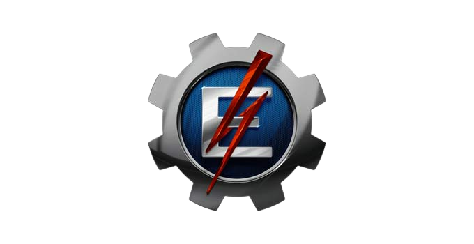

# Trabalho Final de Orientação a Objetos

   
## Descrição

O projeto foi pensado para agregar o maior setor dentre as atividades econômicas brasileiras: o agronegócio. Cada vez mais empresas como New Holland e John Deere investem em tecnologias de automatização e melhoria no processo de plantio, e isso se deve ao fato de que, quanto mais a população mundial cresce, mais alimento é necessário, ou seja, cada vez mais a população necessita do que vem da terra, o que implica na necessidade de um melhor aproveitamento do solo, otimizando 100% do tempo e espaço, desde o plantio até a colheita. Com essa necessidade em mãos, nosso projeto promete automatizar a regularização do solo, identificando individualmente três características básicas: umidade, pH e fertilização de cada trecho de terra, e conforme os sensores identificam carências, o software calcula e ativa o módulo de ajuste (jatos de água, calcário ou fertilizante) para que o solo seja corrigido instantâneamente com base no tipo de plantio que será realizado naquele local.

## Rodando o programa

### Dependências 

Dependecies java etc

## Patterns Utilizados
* Factory
* Strategy
* Observer

## Authors

Victor Kruze FIori 

Samuel Canellas Ferreira 

Ryan Augusto Ribeiro 

Vitoria Thais da Silva 

## Histórico de versionamento

* 0.1
    * Initial Release
    * Somente estrutura
    
* 0.5
    * Estrutura inicial melhor planejada
    * Patter de Strategy e Pattern de Factory quase implementados totalmente
    
* 1.0
   * Patterns Strategy e Factory implementados
